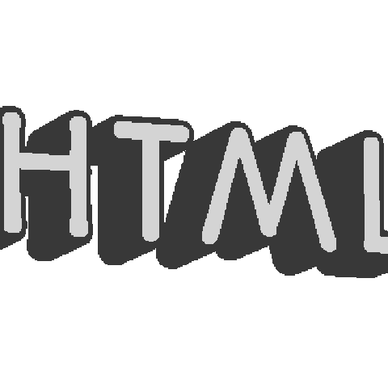
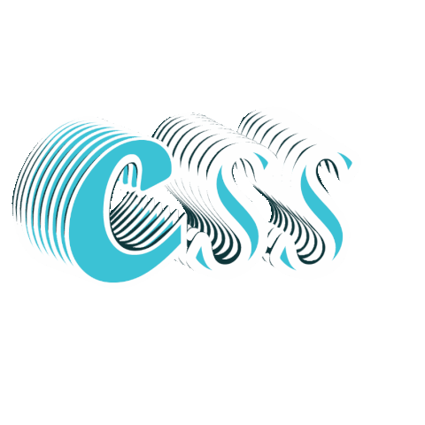
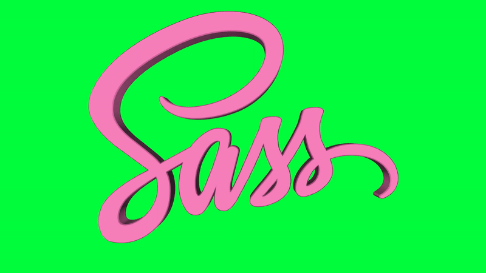
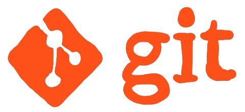

<h1>Hi there 👋, I'm <b>Tanishk Kumar</b>!</h1>

I'm a passionate <b>web developer</b> with a strong focus on creating visually appealing, user-friendly, and interactive websites. My work primarily revolves around dark themes with a flair for animation and modern design.

<h2>Skills</h2>
<h3>🔧 Known Languages & Tools: Languages:</h3>

🚀 What I'm Working On: Improving designs for interactive elements such as carousels, accordions, and navigations with JavaScript, Tailwind CSS, and Bootstrap.

🌱 Learning & Growth: Enhancing my skills in UI/UX design to create more engaging user experiences. Exploring new ways to incorporate Tailwind CSS for efficient and scalable design.

💼 Experience: Completed a 3-month web development internship at Offbeat Pixels, where I worked on four projects, honing my skills in web design and development.

📫 How to Reach Me:

<ul>
  <li>Contact No.: 95576213131 </li>
  <li>Email: tanishkk60@gmail.com</li>
</ul>
